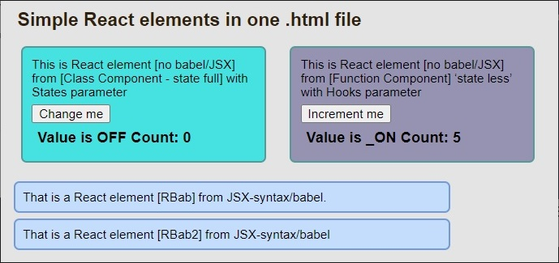

# Simple React elements in one .html file

This page demonstrates using React with no build tooling, no use NPM. React elements are composed of [Class Component (state full)] and [Function Component (state less)]. The [Function Component] uses the Hook technique.

- React without NPM;
- Project in one .html file;
- Defined and used 4 React components;
- Used Class_Component, Function_Component and components with JSX syntax;
- Adding React elements to a regular html webpage;

 

## Details

- React ver.18 sources are linked online from the internet;
- The Babel ver.5.8 compiler for JSX syntax is linked online from the Internet;
- Project written in Visual Studio Code;
